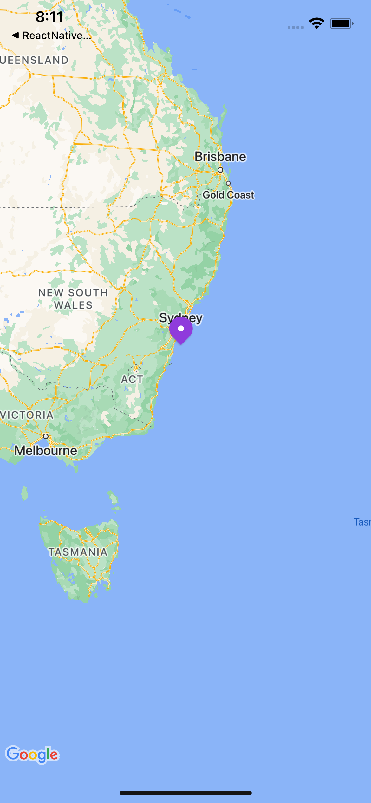
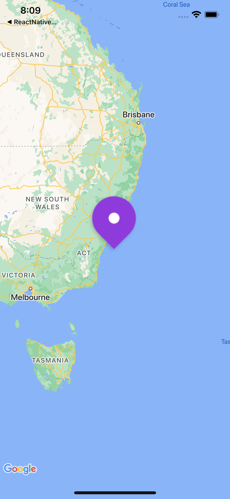

# Expo React Native Maps Sample project

This project showcases a bug with react-native-maps on iOS when using the `icon` or `image` prop to render a custom Marker.

There is a difference in behaviour when the assets are being loaded locally compared to the actual result when the assets are bundled natively during the build. The result is that the marker's icon appears much larger than it should.

## Running this project

1. Follow the steps [here](https://docs.expo.dev/versions/latest/sdk/map-view/#deploy-app-with-google-maps) to enter the google maps credentials
2. `yarn install`
3. `yarn ios`
4. `npx expo start --tunnel --clear`← こっち普段を使っている

### Expected Result

### Actual result

By simulating the result of asset bundling by using expo-asset to cache the assets on startup on App.tsx.

